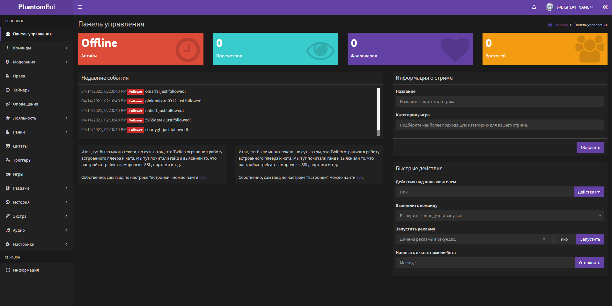
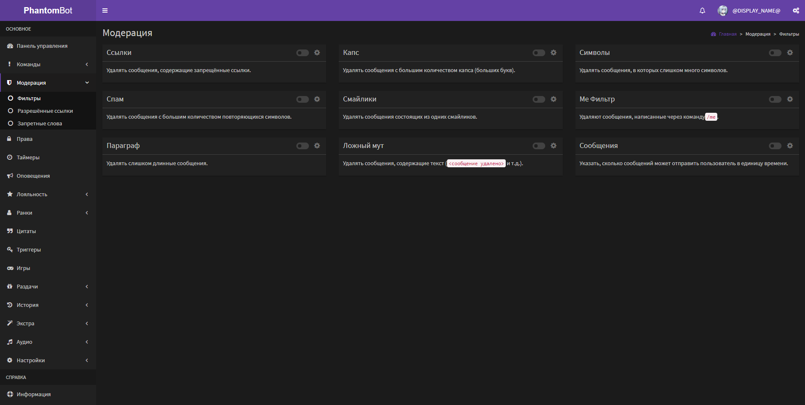

# PhantomBotRUS

Перевод на русский язык для проекта [PhantomBot](https://github.com/PhantomBot/PhantomBot)

   

---

## Особенности

На данный момент переведена вся веб-панель, кроме всплывающих окон и таблиц и много ответов в чате. В моих планах, как и полагается, довести всё до 100% (по крайней мере для текущей стабильной версии).

## Скриншоты

##### Веб-панель

## Требования

Нужен сам [PhantomBot](https://github.com/PhantomBot/PhantomBot), как минимум версии 3.4.2 (иначе **возможны** проблемы с совместимостью).

## Скачать

[GitHub](https://github.com/modetass/PhantomBotRUS/releases)

[Наш Сайт](https://mdts-forum.rf.gd/forumdisplay.php?fid=13)

## Инструкция по установке

На обоих сайтах вы можете выбрать между установщиком и архивом. В первом варианте вы указываете расположение бота в качестве пути установки, а во втором просто распаковываете в корневую папку бота (там где launch.bat).
